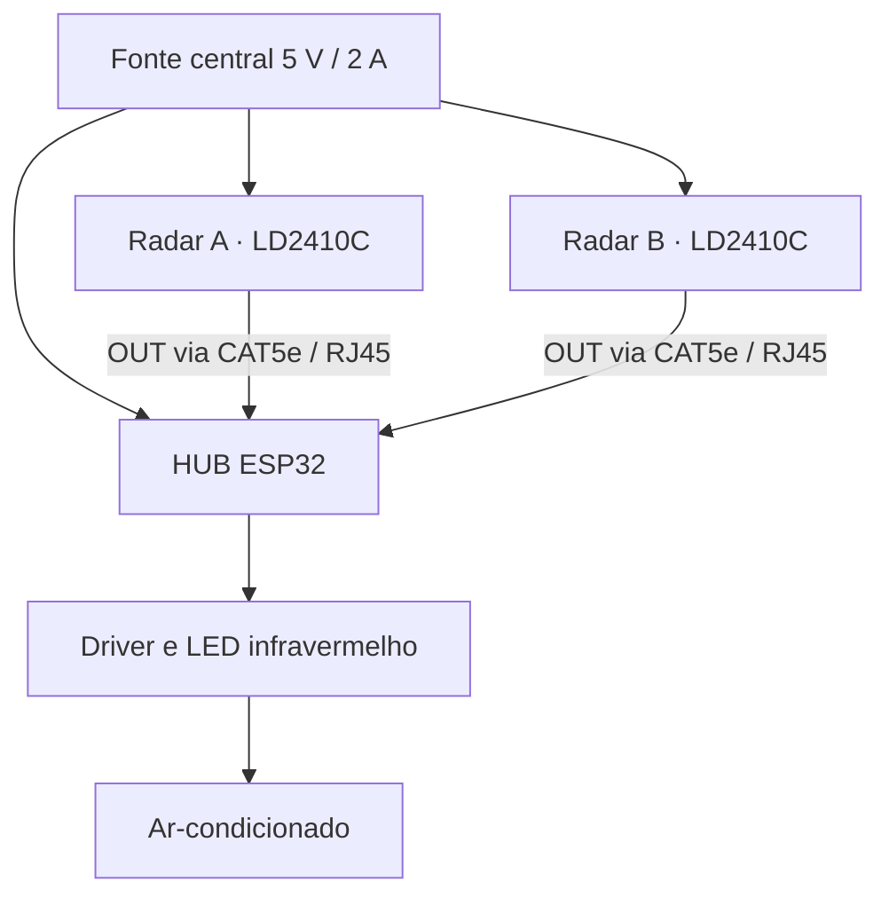

# EcoCube

Projeto de controle de ar-condicionado por ocupação para salas de aula, com dois radares mmWave e um HUB baseado em ESP32. O objetivo é desligar o ar após um período de sala vazia, preservando o controle manual.

**Status: 🟡 Pesquisa e projeto — arquitetura definida; integração e validação física pendentes.**

## Problema

Um ar-condicionado pode permanecer ligado depois que a sala esvazia. A detecção precisa considerar pessoas sentadas e quase imóveis, para evitar desligamentos durante aulas ou provas.

O cenário inicial é uma sala aproximadamente quadrada, com cerca de 30 pessoas. A principal incerteza é a cobertura real dos sensores nesse ambiente.

## Solução proposta

Dois HLK-LD2410C detectariam presença em posições opostas ou diagonais. O HUB considera a sala ocupada quando **qualquer sensor** indica presença.

Quando ambos indicarem ausência por um intervalo contínuo, inicialmente **10–15 minutos para teste**, o ESP32 enviará um comando infravermelho `POWER OFF`. O usuário continuará ligando e controlando o ar pelo controle original; o sistema não cortará a alimentação do aparelho.

## Arquitetura prevista

Os conectores RJ45 transportam alimentação e sinais digitais em uma pinagem própria: **não são Ethernet nem PoE**. Os radares receberão energia da fonte central, em paralelo com o HUB.

## Tecnologias previstas

- ESP32 DevKit e dois radares mmWave de 24 GHz HLK-LD2410C.
- Entradas digitais OUT, lógica OR e temporizador de ausência.
- Cabeamento CAT5e com conectores RJ45.
- Emissor IR de 940 nm com transistor/driver.

## Status real

**Já documentado:** requisitos, arquitetura com dois sensores, distribuição de alimentação, pinagem dos conectores e critérios de teste.

**Ainda pendente:** validar os sensores e o cabeamento em bancada, integrar o temporizador e o IR, testar uma sala piloto e medir economia energética.

Este repositório contém documentação de projeto. Ainda não inclui firmware, esquemáticos, CAD ou resultados de testes reproduzíveis. O antigo marco “sensor → LED concluído” não está confirmado na documentação atual e não é apresentado como validação da nova arquitetura.

Iluminação, sensores ambientais, medição de energia e dashboard são **expansões futuras**, fora do MVP.

## Próximos passos

1. Confirmar a placa ESP32 e validar um radar com fonte externa de 5 V.
2. Testar o cabeamento e dois sensores, medindo falsos positivos e negativos.
3. Implementar a temporização; testar a decisão com LED antes de integrar IR.
4. Validar o comando OFF no aparelho e a cobertura na sala piloto.

## Documentação

- [Arquitetura e interfaces](docs/architecture.md): alimentação, pinagem e decisões de projeto.
- [Plano de validação](ROADMAP.md): próximos marcos e evidências esperadas.

Projeto acadêmico de João Pedro de Lima Campos — Engenharia de Controle e Automação, UFMT.

[Licença MIT](LICENSE)
